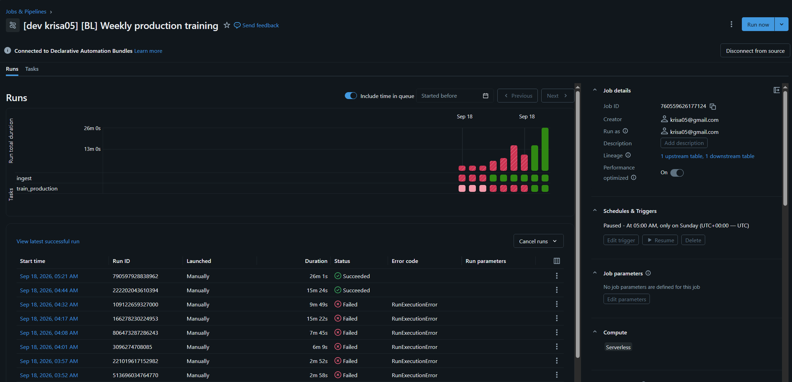

# Business Loans — Brand Ranking

A production ML system that ranks lender brands for a user at the moment they complete a
lead-generation funnel. It productionises two research scripts on Databricks with MLflow,
with their functions and logic unchanged.

The ranking sits on a synchronous, user-facing path: a person is waiting on the landing
page, and the order of brands determines revenue per session.

```
CatBoostClassifier  →  P(brand accepts this lead)
                                                   ×  →  expected_payout  →  rank
TabPFNRegressor     →  payout if accepted
```

> **Part 2 write-up:** implementation, dilemmas, decisions, production operation, issues,
> improvements and alternatives considered are in
> **[Part2_Implementation_and_Decisions.docx](Part2_Implementation_and_Decisions.docx)**
> at the repository root.

---

## Contents

- [Quick start](#quick-start)
- [Assignment requirements](#assignment-requirements)
- [Architecture](#architecture)
- [Serving](#serving)
- [TabPFN execution: local or hosted](#tabpfn-execution-local-weights-or-hosted-api)
- [Training, tracking and artifacts](#training-tracking-and-artifacts)
- [Versioning and rollback](#versioning-and-rollback)
- [Scheduling](#scheduling)
- [Performance](#performance)
- [Engineering decisions](#engineering-decisions)
- [Databricks deployment](#databricks-deployment)
- [Repository layout](#repository-layout)
- [Limitations](#limitations)
- [Part 2 write-up](#part-2-write-up)

---

## Quick start

No accounts, tokens or signups are required for the local path.

**Prerequisites:** Docker, and `bl_full_data.csv` placed in `Task/`.

```bash
docker compose --profile build --profile train build   # all images (~10 min first time)
docker compose up -d mlflow
docker compose run --rm trainer                        # trains and registers a version
docker compose up -d serving scheduler
```

The `serving`, `trainer` and `scheduler` images share a common base, so build them together
— building only `base` leaves any previously built images on the old one.

Training takes a few minutes. The serving container then needs ~130 s to warm up, during
which `docker compose ps` shows `health: starting` and `/health` returns `503`; it loads the
model and fits the TabPFN context once at startup so that requests do not pay for it.

| Service | URL |
|---|---|
| Ranking endpoint | <http://localhost:8088> |
| API explorer | <http://localhost:8088/docs> |
| MLflow UI | <http://localhost:5000> |

```bash
curl -s localhost:8088/rank -H "content-type: application/json" -d @examples/user.json
```

On Windows PowerShell, call `curl.exe` — `curl` there is an alias for
`Invoke-WebRequest`, which does not accept `-s`, `-H` or `-d`:

```powershell
curl.exe -s localhost:8088/rank -H "content-type: application/json" -d "@examples/user.json"
```

Step-by-step instructions for all three paths — Docker, a local venv and Databricks —
are in the [runbook](docs/RUNBOOK.md). Python 3.12+ is required 

---

## Assignment requirements

| Requirement | Implementation | Evidence |
|---|---|---|
| Productionise both scripts, logic unchanged | Originals vendored byte-identical in `src/bl_ranker/original/`; production code subclasses them | `src/bl_ranker/training/trainer.py` |
| Training pipeline, both modes | `--mode train_test` (evaluates, writes nothing) and `--mode production` (trains on all data, registers artifacts) | `src/bl_ranker/training/run.py` |
| Weekly production run, Sunday 05:00 | APScheduler container locally; a job schedule on Databricks, deployed and verified in the workspace | `src/bl_ranker/scheduler/`, [docs/DATABRICKS.md](docs/DATABRICKS.md) |
| Technical parameters logged so runs are comparable | Params, metrics, stepped series and charts logged per run | MLflow UI |
| Researcher's log saved as an artifact | `.log` uploaded verbatim, plus parsed into comparable metrics | `src/bl_ranker/training/metrics_capture.py` |
| Artifacts versioned; serving version identifiable and reversible | MLflow Model Registry with `@champion` / `@previous` aliases | `src/bl_ranker/rollback.py` |
| TabPFN productionised efficiently | Both backends ship and are runtime-selectable; default is local weights with the context fitted once at startup — **70× faster per request** | [TabPFN execution](#tabpfn-execution-local-weights-or-hosted-api) |
| Endpoint: dict in → ranked brand dict out | `POST /rank`, FastAPI | [Serving](#serving) |
| Load simulation, median and tail latency | Closed-loop sweep, open-loop burst tests, and a replay of real arrivals | [Performance](#performance) |

---

## Architecture

```
                    ┌──────────────┐
  Delta table  ───► │   Training   │ ──►  MLflow  ──►  Model Registry
  (bl_sessions)     │  (weekly)    │      tracking     @champion / @previous
                    └──────────────┘                          │
                                                              ▼
  User dict  ──────────────────────────────────────►  ┌──────────────┐
                                                      │   FastAPI    │
  Ranked brand dict  ◄────────────────────────────────│   /rank      │
                                                      └──────────────┘
```

Training and serving share one package. The only differences between local and Databricks
are the tracking URI and the data location, and both arrive as task parameters rather than
as code changes.

The served model is a single composite MLflow pyfunc holding the CatBoost classifier, the
TabPFN payout context, the brand universe and the feature-engineering code. One registry
version therefore pins *everything* needed to reproduce a ranking, so a rollback moves all
of it together.

---

## Serving

`POST /rank` takes one user's post-funnel data as a JSON object and returns every brand
scored for that user, ordered best-first. Unknown fields are accepted and ignored, so a raw
session row can be posted unchanged.

**Request** (abridged — see `examples/user.json`):

```json
{
  "credit_score": "Very Poor - Under 550",
  "industry": "construction",
  "loan_amount": "$25,000 - $49,999",
  "monthly_revenue": "$20,000 - $49,999",
  "time_in_business": "2+ years",
  "register_date": "2026-01-06 19:26:07"
}
```

**Response:**

```json
{
  "ranking": {
    "xlt":                  {"rank": 1, "expected_payout": 64.44},
    "businessloans.com":    {"rank": 2, "expected_payout": 25.18},
    "fundera / nerdwallet": {"rank": 3, "expected_payout": 7.26}
  },
  "model_version": "4",
  "latency_ms": 1028.26
}
```

A user who cannot be scored — for example one with too many missing survey answers —
returns an empty `ranking` rather than an error. A user with no `register_date` cannot be a
lead at all and returns `422`.

`GET /health` reports readiness and the live model version, and is what the container
health check and any orchestrator should poll.

Everything expensive happens once at startup: model load, TabPFN context fit, and the name
dataset. A request performs preprocessing, one `predict_proba` and one TabPFN forward pass
over ten rows.

---

## TabPFN execution: local weights or hosted API

TabPFN is an in-context learner: `fit()` does not train, it hands the model its context.
The same model is therefore available two ways, and **both ship here**, selected at runtime.

```bash
# default — local open-source weights, in-process, no account needed
docker compose up -d serving

# hosted — Prior Labs API, the researcher's original design
docker compose -f docker-compose.yml -f docker-compose.hosted.yml up -d serving
```

The hosted backend requires `TABPFN_TOKEN` in `.env`. `GET /health` reports the active
backend as `local-oss-cpu` or `hosted-api`.

### Measured comparison

Identical payloads, identical endpoint, 60 requests per configuration.

| | local (v2 weights, CPU) | hosted (v3, API) |
|---|---:|---:|
| cold start | 130 s | **75 s** |
| memory | 3.0 GB | **~1 GB** |
| **one user** — p50 | **1190 ms** | 1623 ms |
| **one user** — p99 | **1254 ms** | 19,296 ms |
| **burst of 10, every 10 s** — p50 | 14.80 s | **2.65 s** |
| **burst of 10, every 6 s** — p50 | 50.05 s | **2.25 s** |
| sustained concurrency 10 | 0 failures | **10 / 60 failed** (`HTTP 429`) |

The two backends run different model versions (v2 open-source, v3 hosted). On identical
inputs, predicted payouts differ by at most **$0.82** on values averaging $55, and the
top-ranked brand is unchanged.

### Which to use

The two win in different regimes, and the reason is structural: **hosted waits on a network
in parallel, local computes on a CPU in series.** Ten concurrent network waits cost about
as much as one; ten concurrent forward passes cost ten times one.

**Local is the default.** Measured demand averages 0.0115 rps, and the busiest minute in
62 days held 24 requests — within the range where local serves each burst without a
backlog. Local also gives lower single-user latency, no rate limit, no per-call cost and no
external dependency.

**Hosted suits burstier traffic** — sustained arrivals above ~1 rps, or a deployment model
where a 130 s cold start is prohibitive. It is subject to a 60 predict/minute rate limit,
above which requests fail rather than queue, and its tail latency is not under our
control.

---

## Training, tracking and artifacts

Both of the researcher's modes are preserved:

```bash
python -m bl_ranker.training.run --mode train_test    # evaluates; writes nothing
python -m bl_ranker.training.run --mode production    # trains on all data; registers
```

Each run logs:

- **Parameters** — data window, row counts, model hyperparameters, TabPFN configuration,
  git SHA, mode
- **Metrics** — payout MAPE/MAE (headline and swept across thresholds), lead accuracy and
  weighted F1, both overall and per day of the held-out week
- **Artifacts** — the researcher's `.log` verbatim, the four model artifacts, an example
  payload, and charts

Per-day figures are logged as **stepped series**, so they chart as a line across the
held-out week. Day-level accuracy is accompanied by its support count, since some days in
this dataset hold very few rows.

Charts logged per run: feature importance, confusion matrix, predicted-vs-actual payout,
calibration, per-brand performance, and a run summary.

---

## Versioning and rollback

Promotion and rollback are alias moves in the MLflow Model Registry. Serving resolves
`models:/bl_brand_ranker@champion`, so nothing needs redeploying to change version.

```bash
python -m bl_ranker.rollback --list           # show versions and aliases
python -m bl_ranker.rollback --to-previous    # revert to the prior champion
python -m bl_ranker.rollback --to-version 3   # pin a specific version
```

```
 version  alias        status     run        created
       3  @previous    READY      bd441ad5   ...
       4  @champion    READY      a77caecb   ...
```

---

## Scheduling

The production run is scheduled **weekly, Sunday 05:00**.

- **Locally** — an APScheduler container. On start it logs the next fire time, so the
  schedule is verifiable without waiting a week.
- **On Databricks** — a job schedule declared in the Asset Bundle, deployed and visible in
  the Jobs UI ([evidence](docs/DATABRICKS.md)). A second job evaluates at 03:00, two hours
  earlier, so the accuracy report exists before new artifacts are registered.

Both Databricks jobs deploy `PAUSED`. The schedule is declared and visible in the Jobs UI;
set `UNPAUSED` to activate.

---

## Performance

Measured in Docker, single worker, CPU-only, Ryzen 5 5600X. Payloads are sampled from
**real rows** of the dataset rather than a replayed fixture.

### Single user — what a real request costs

| | p50 | p95 | p99 | failures |
|---|---:|---:|---:|---:|
| 200 requests, concurrency 1 | **1054 ms** | 1096 ms | **1120 ms** | 0 |

p99 is 6% above p50. That tight a tail is the result of moving every expensive operation to
startup: no network call, no cache miss, no model load on the request path.

### Under concurrency


975 requests across concurrency 1–100, **zero failures**. Throughput is flat at ~0.92 rps
throughout: the service saturates at one request in flight, so additional concurrency is
paid for entirely in waiting. This is a capacity measurement, not a latency one.

### Under burst


Real traffic arrives in bursts and then goes quiet, so an open-loop test — bursts fired on
a wall-clock schedule whether or not the server keeps up — is the one that reveals whether
a backlog forms.

| 10 users every… | offered | completed | p50 | behaviour |
|---|---:|---:|---:|---|
| 6 s | 1.67 rps | 0.96 rps | 50.1 s | backlog grows |
| 10 s | 1.00 rps | 0.93 rps | 14.8 s | creeping up |
| **12 s** | 0.83 rps | 0.83 rps | **10.6 s** | **flat, fully drains** |

### Against real demand

Sustained-load figures overstate what a user experiences, because a queue that builds
during a burst drains during the lull. Replaying all **62,724 real arrival timestamps**
through an M/D/c queue at the measured service time:

Service time is taken from the **measured** throughput of each configuration, not assumed
constant across them — one request already saturates every core, so a second worker does
not run at the same speed as a lone one (1.07 rps on one worker vs 0.83 rps on two).

| | 1 worker (0.93 s service) | 2 workers (2.41 s service) |
|---|---:|---:|
| p50 | **0.93 s** | 2.41 s |
| p95 | **1.47 s** | 2.41 s |
| p99 | **1.85 s** | 3.48 s |
| **users exceeding 3 s** | **0.19 %** | 1.17 % |
| worst request in 62 days | **9.38 s** | 13.61 s |
| never queued at all | 92.0 % | **98.7 %** |

Two workers queue *less often* but serve *much slower*, and serving slower dominates: six
times as many users cross three seconds. This is the same result as the direct load test,
arrived at independently.

Demand peaks at 2,398 rankings/day, 176/hour and 11 in a single second. Measured capacity
gives **18.8× headroom on the busiest hour observed**.

Full methodology, raw results and reproduction commands:
**[`loadtest/README.md`](loadtest/README.md)**.

---

## Engineering decisions

| Decision | Alternative | Why, and the evidence |
|---|---|---|
| **TabPFN from local open-source weights** *as the default* | Hosted Prior Labs API (the original design) | Both ship; this is a default, not an exclusion — see [TabPFN execution](#tabpfn-execution-local-weights-or-hosted-api). Local wins on single-user latency (p99 1.25 s vs 19.3 s), needs no account and cannot be rate-limited. Hosted wins under burst, because it waits in parallel rather than computing in series. The measured traffic sits in local's regime. |
| **Fit the TabPFN context once at startup** (`fit_with_cache`) | Fit per request, as the original does | **77,000 ms → 1,067 ms per request**, a 70× reduction. Verified equivalent: max absolute difference 3.7e-4 on payouts around $148, identical ranking order. |
| **Keep `n_estimators=8`** | Reduce to 1 for a 9× speedup | Declined. At `n_estimators=1` the **top-ranked brand changes for half of all users**. Since users click the first brand, that is a different product, not a latency win. |
| **FastAPI rather than `mlflow models serve`** | MLflow's built-in scoring server | The registry is kept for versioning and rollback; the scoring server is replaced. It is a generic DataFrame wrapper that does not match the dictionary contract, and gives no control over startup warm-up — the single largest lever on latency. |
| **Synchronous handler (`def`, not `async def`)** | `async def` | ~1 s of blocking CPU inside an `async` handler freezes the event loop. Found by load testing at concurrency 8: 4 of 60 requests dropped, p99 14.4 s. A `def` handler is dispatched to a threadpool: 0 failures, p99 8.1 s. |
| **One uvicorn worker** | Two or more | Measured twice, independently. Direct load test: 2 workers were **worse** (1.07 → 0.83 rps, p50 1.19 s → 1.49 s). Replaying real arrivals with each configuration's measured service time agrees: **0.19 % of users exceed 3 s on one worker vs 1.17 % on two.** One request already parallelises across every core, so a second worker halves the cores each gets. Scaling means more machines, not more processes. |
| **Composite pyfunc, one registry version** | Separate artifacts versioned independently | A ranking depends on the classifier, the payout context, the brand universe and the feature code agreeing. Bundling them makes a rollback atomic. |
| **`tabpfn` pinned to exactly 2.0.9** | A loose `>=2.0` bound | Later releases gate the weight download behind licence acceptance and require a token even for local inference, failing in any non-interactive environment. The loose bound broke a Databricks run. |

### Latency work

Per-request costs removed from the original inference path:

| | original | here |
|---|---|---|
| TabPFN context fit | every request | once, at startup |
| CatBoost model load | every request | once, at startup |
| Brand universe read | every request | once, at startup |
| Log file creation + handler reset | every request | module logger |
| Name lookup | 10× per request | memoised → 1× |

### Three bugs found in the original scripts

The first two are reported rather than fixed, since the assignment requires the logic
unchanged. The third is a platform portability defect that silently corrupts a feature, so
the serving path pins the correct type while the original scripts are left untouched.

1. A per-day log message builds its label with string concatenation instead of an
   f-string, so every per-day report reaches the log as the literal text `for day {day}`.
   The production metrics parser recovers the day positionally.
2. A threshold sweep reuses a filtered frame across iterations, so thresholds compound
   rather than being applied independently.
3. **`cellphone_prefix` overflows to a negative value on Windows.**
   `bl_data['cellphone'].astype(int)` takes numpy's *platform default* integer: int64 on
   Linux, **int32 on Windows**. A US phone number has ten digits (~7.8e9) against an int32
   ceiling of 2,147,483,647, so the value wraps negative and the prefix is wrong:

   ```
   7869914030  ->  .astype(int)  ->  -720020562  ->  str[:3]  ->  '-72'   (expected '786')
   ```

   This is not cosmetic: `cellphone_prefix` is a CatBoost feature. A model trained on Linux
   has never seen `'-72'`, so it arrives as an unknown category encoded as zeros. Measured
   on the same user and the same model version, `P(lead)` for the top brand moved from
   **0.7771** (Linux) to **0.3632** (Windows) -- enough to change the scores and how many
   brands clear the `expected_payout > 0.01` cut-off. The serving path pins `int64` so
   Windows agrees with the Linux training environment.

## Databricks deployment

```bash
databricks bundle validate -t dev
databricks bundle deploy -t dev
databricks bundle run bl_weekly_production_training -t dev
```

Two jobs are deployed — weekly production training (Sunday 05:00 UTC) and weekly train/test
evaluation (Sunday 03:00 UTC) — and both have completed successfully in a live workspace.



Job definitions, task parameters, the execution record and further workspace screenshots
are in **[docs/DATABRICKS.md](docs/DATABRICKS.md)**.

Compute is **serverless**: the bundle declares no job clusters, and dependencies are
declared per serverless environment. Configuration is passed as CLI arguments, since
serverless provides no cluster environment variables.

`pyproject.toml` declares loosely-bounded dependencies for deployment targets that ship
their own pandas, numpy and mlflow; `requirements.txt` holds exact pins for local and
Docker.

The bundle is parameterised (`--var catalog=…`, `--var schema=…`) and is not tied to one
workspace. No credential is committed: `.env` is gitignored and the Databricks profile
lives outside the repository.

---

## Repository layout

| Path | Contents |
|---|---|
| `src/bl_ranker/original/` | The researcher's two scripts, vendored unchanged |
| `src/bl_ranker/training/` | Production trainer, MLflow entrypoint, metrics parsing, charts |
| `src/bl_ranker/serving/` | Composite pyfunc, FastAPI app, request/response schemas |
| `src/bl_ranker/scheduler/` | Weekly production run |
| `src/bl_ranker/rollback.py` | Registry alias management |
| `loadtest/` | Load simulation tools, raw results and charts |
| `benchmarks/` | Latency-vs-fidelity experiments |
| `databricks/databricks.yml` | Asset Bundle: jobs, schedule, Unity Catalog wiring |
| `docker/`, `docker-compose.yml` | Full local stack |
| `docker-compose.hosted.yml` | Overlay switching serving to the hosted TabPFN API |
| `Part2_Implementation_and_Decisions.docx` | **Part 2 write-up** — decisions, operation, issues, alternatives |
| `docs/RUNBOOK.md` | Step-by-step local and Databricks instructions |
| `docs/DATABRICKS.md` | Deployed jobs, schedules and execution record |
| `docs/ENGINEERING_NOTES.md` | Extended notes: full measurements and rejected alternatives |

---

## Limitations

- **Latency is bounded by CPU inference.** ~90 % of the 1.05 s is a single TabPFN forward
  pass. No concurrency work moves it; a GPU would be expected to reduce it to the low
  hundreds of milliseconds. This could not be measured here — the development machine has
  an AMD GPU, and Databricks Free Edition serving is CPU-only.
- **Ranking quality is not evaluated end-to-end.** The models are evaluated separately, as
  the researcher's code does. The metric that matters commercially is revenue per session,
  which requires a shadow deployment or A/B test.
- **`client_name` carries 40.8 % of the classifier's feature importance**, which suggests
  the ranking is closer to a global brand ordering than to per-user personalisation. Worth
  investigating before treating the output as personalised.
- **The weekly run promotes unconditionally.** A gate that refuses promotion when test-set
  error regresses beyond a threshold would make the schedule safe to leave unattended.
- **Registered model versions pin their logging-time environment**, which has since drifted.
  This does not affect the shipped stack, which builds from `requirements.txt`, but a
  registry version deployed into a fresh environment would need re-logging first.

---

## Part 2 write-up

The accompanying document —
**[Part2_Implementation_and_Decisions.docx](Part2_Implementation_and_Decisions.docx)** —
covers the implementation, the dilemmas encountered and how they were decided, how the
system runs in production, the issues that remain, ways to improve it, and the alternatives
that were considered and rejected. Every figure in it is reproducible from this repository.
