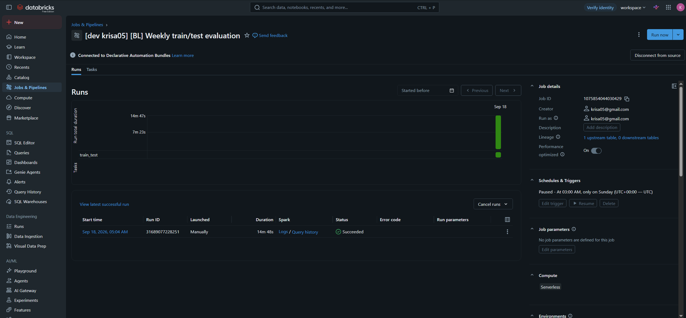
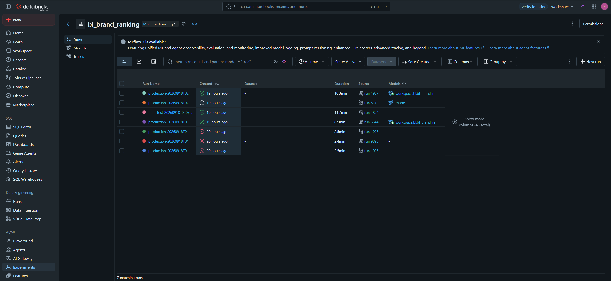

# Databricks deployment

The training pipeline runs on Databricks as an Asset Bundle
([`databricks/databricks.yml`](../databricks/databricks.yml)). It has been deployed and
executed on a live workspace; this page records what runs there and the evidence that it
ran, since the workspace is private.

## What is deployed

Two scheduled jobs, both built from the same wheel (`bl_ranker-1.0.0-py3-none-any.whl`)
and running on serverless compute with Python 3.12.

### Weekly production training — **Sundays at 05:00 UTC**

| task | entry point | what it does |
|---|---|---|
| `ingest` | `bl_ranker:ingest` | loads the CSV from a Unity Catalog volume into the Delta table |
| `train_production` | `bl_ranker:train` | trains on all data, registers a version, moves `@champion` |

### Weekly train/test evaluation — **Sundays at 03:00 UTC**

| task | entry point | what it does |
|---|---|---|
| `train_test` | `bl_ranker:train` | evaluates on the held-out week and writes no artifacts |

Evaluation runs two hours before production, so the accuracy report for the week is
available before new artifacts are registered.

Both jobs deploy **paused**. The schedules are declared and visible in the Jobs UI, but a
free-tier workspace should not be left running unattended every week; resume them to
activate.

Configuration reaches the code as **command-line parameters**, never as edited source. The
same package runs locally and on Databricks, and only the tracking URI and the data
location differ between them. Serverless compute offers no cluster environment variables,
which is why parameters are passed this way.

## Evidence

### Weekly production training


The workspace states the schedule as *At 05:00 AM, only on Sunday (UTC)*, confirms
**Serverless** compute, and shows the task graph running `ingest` into `train_production`.

### Weekly train/test evaluation



The same, at 03:00 on Sunday, with the single `train_test` task.

### MLflow tracking and Unity Catalog registration



The `bl_brand_ranking` experiment in the workspace MLflow instance. Both modes appear as
`production-*` and `train_test-*` runs, and each successful production run links to a
version of `workspace.bl.bl_brand_ranker` in Unity Catalog — which is what makes a served
version identifiable and reversible.

The identical code produces these runs locally against a local tracking server. Only
`--tracking-uri` and `--registry-uri` change.

### Run history

| job | result | started (UTC) | duration |
|---|---|---|---|
| Weekly production training | **Succeeded** | 2026-09-18 02:21 | 26m 01s |
| Weekly production training | **Succeeded** | 2026-09-18 01:44 | 15m 24s |
| Weekly train/test evaluation | **Succeeded** | 2026-09-18 02:04 | 14m 48s |

The production job also has six failed runs earlier that morning, between 00:51 and 01:32.
They are kept here rather than omitted, because what caused them is the substance of
deploying to a new platform:

**Missing dependencies.** The wheel declared none, so the serverless environment had to
restate them by hand and each run failed on a different missing import — `deltalake`, then
`pydantic_settings`, then `tabpfn_client`. Fixed by declaring dependencies in
`pyproject.toml`, and by making the delta-rs and PySpark imports lazy so neither platform
pays for the other's.

**`TabPFNLicenseError`.** A loose `tabpfn>=2.0` bound allowed a newer release that gates
its weight download behind licence acceptance, which cannot be given in a non-interactive
job. Fixed by pinning `tabpfn==2.0.9`.

**Wrong Python version.** Serverless environment version 2 ships Python 3.11, and the
researcher's scripts need 3.12 for their PEP 701 f-strings. Fixed by moving to environment
version 4.

**Invalid experiment name.** Databricks requires an absolute workspace path, which the
local default is not. Fixed by passing `--experiment`.

## Platform decisions

**Serverless only.** Free Edition does not support custom compute, so the bundle declares
no job clusters and no node types, and dependencies are declared per serverless
environment. A bundle written the conventional way, around job clusters, is rejected
outright.

**Catalog.** Free Edition has no `main` catalog; its writable managed catalog is
`workspace`, which is the bundle's default. A paid workspace can override it.

**Source data** is read from a Unity Catalog volume at
`/Volumes/<catalog>/<schema>/raw/bl_full_data.csv`, since the CSV is not in the repository.

**Tracking and registry** are set to `databricks` and `databricks-uc`, so runs land in the
workspace MLflow instance and models register into Unity Catalog. Under Unity Catalog model
names are three-level (`catalog.schema.name`), which is why the registered model is passed
in explicitly rather than assumed.

## Deploying it yourself

Requires a Databricks workspace and a configured CLI profile — see
[Part C of the runbook](RUNBOOK.md#part-c--databricks) for the full setup.

```bash
databricks bundle validate -t dev -p bl
databricks bundle deploy   -t dev -p bl
databricks bundle run bl_weekly_production_training -t dev -p bl
```

Run `validate` first: it catches schema problems before anything is uploaded.

The bundle is parameterised rather than tied to one workspace, so a different catalog or
schema needs no edit:

```bash
databricks bundle deploy -t dev -p bl --var catalog=main --var schema=bl
```
