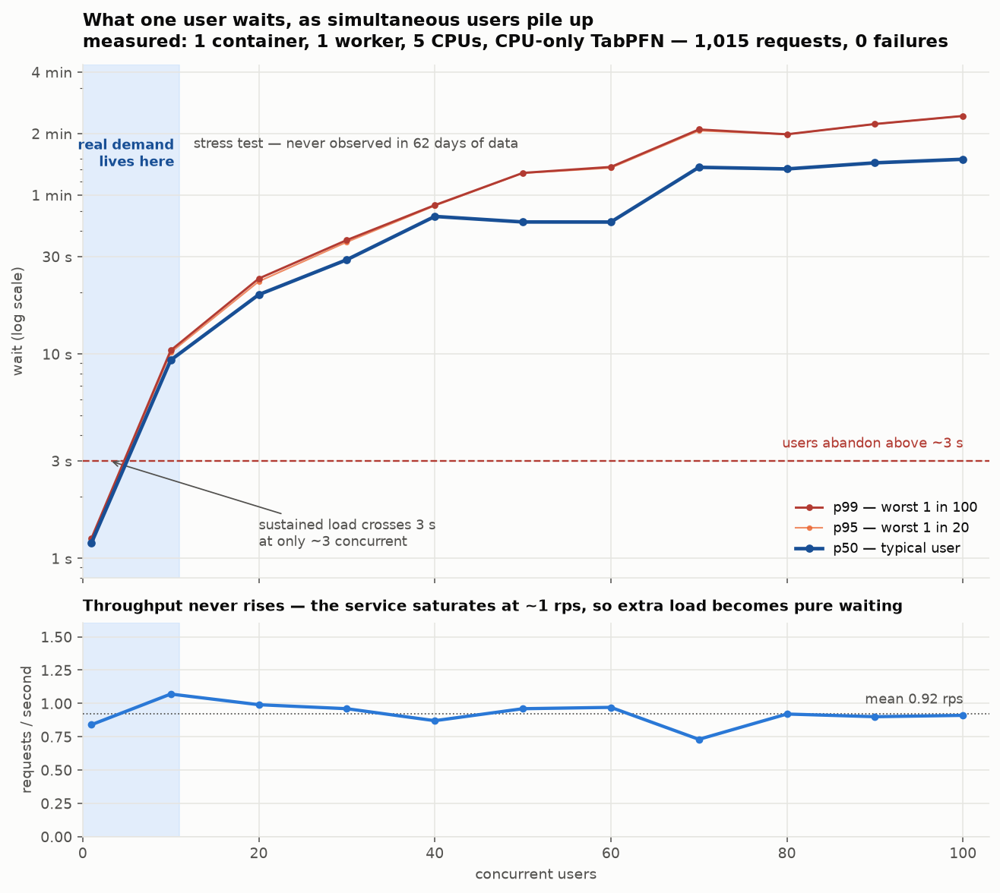
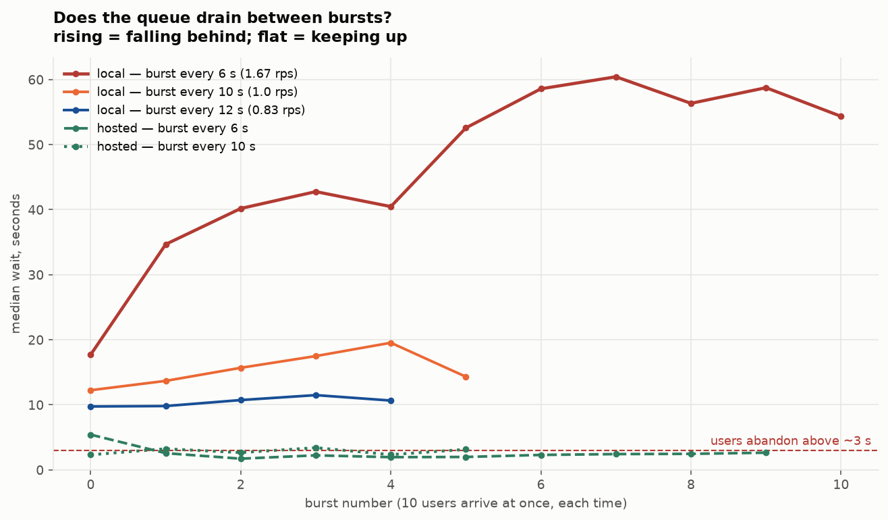

# Load simulation: tools, raw results and charts

Everything the README's §6 claims is reproducible from here. Raw JSON is kept rather than
only the summary tables, because a percentile with no sample behind it is an assertion.

## Tools

| script | what it answers |
|---|---|
| `simulate.py` | **closed-loop**: N virtual users, each waiting for its reply before sending again. Reports median and tail latency at fixed concurrency. |
| `sweep.py` | runs `simulate` across concurrency 1→100, writing after every level so a crash at high load keeps what was already measured. Samples container memory/CPU per level. |
| `burst.py` | **open-loop**: fires bursts on a wall-clock schedule regardless of whether the server kept up. The only test here that can show a backlog forming. |
| `replay_demand.py` | replays all 62,724 real `register_date` arrivals through an M/D/c queue. Answers "what would a real user have waited?" rather than "how much abuse can this take?". |
| `plot_latency.py` | chart from `results/sweep.json` |
| `plot_burst.py` | chart from the `results/burst_*.json` runs |

Closed-loop vs open-loop matters: a closed-loop test **cannot** build a backlog, because a
slower server means a slower client. That is not how traffic behaves, which is why both
exist.

## Charts





## Raw results

Payloads are always sampled from **real rows** of `Task/bl_full_data.csv`, never a
replayed fixture -- which is how the schema bug (`sub1` as a zero-padded string, not an
int) was caught.

### Concurrency sweeps -- local backend

| file | run | why it exists |
|---|---|---|
| `sweep.json` | concurrency 1–100, 1,015 requests | the headline sweep; 0 failures throughout, memory peaked 5.6/6 GiB |
| `results_c1.json` | concurrency 1, **200 requests** | the tightest single-user baseline: p50 1054 ms, p99 1120 ms |
| `results_final.json` | concurrency 1,2,4,8 | the post-fix confirmation run |
| `results_2workers.json` | concurrency 1,10 on **2 workers** | the **negative result**: 2 workers were *worse* (1.07 → 0.83 rps). Kept because it disproves "add more workers". |

### Concurrency sweeps -- hosted backend

| file | run | finding |
|---|---|---|
| `results_hosted.json` | concurrency 1,10 via Prior Labs API | 10/60 failed with `HTTP 429` rate limiting; p99 19.3 s at concurrency **1** |

### Burst runs (open-loop, 10 users at once, repeating)

| file | pattern | outcome |
|---|---|---|
| `burst_local_6s.json` | every 6 s = 1.67 rps | backlog grows without bound, 17.7 s → 60 s |
| `burst_local_10s.json` | every 10 s = 1.00 rps | creeping up, 12 s → 19.5 s (just over capacity) |
| `burst_local_12s.json` | every 12 s = 0.83 rps | **flat at ~10 s, fully drains** -- the sustainable spacing |
| `burst_hosted_10s.json` | every 10 s | flat at ~2.7 s, 0 failures |
| `burst_hosted_6s.json` | every 6 s | flat at ~2.3 s, 0 failures, 1.66 rps completed |

### Superseded, kept deliberately

| file | why it is still here |
|---|---|
| `results_docker.json` | the **16-request** run that passed cleanly and **missed** the `async def` event-loop bug. Evidence for why a token-sized load test is not a load test. |
| `results.json`, `results_conc.json`, `results_c8_fixed.json` | earlier smaller runs from the same investigation; superseded by `results_final.json` |

## Reproducing

```bash
# closed-loop sweep (~15 min)
python -m loadtest.sweep --url http://localhost:8088/rank

# open-loop burst
python -m loadtest.burst --size 10 --gap 12 --duration 60

# what real traffic would have felt (no server needed, pure simulation)
python -m loadtest.replay_demand

# charts
python -m loadtest.plot_latency
python -m loadtest.plot_burst
```
